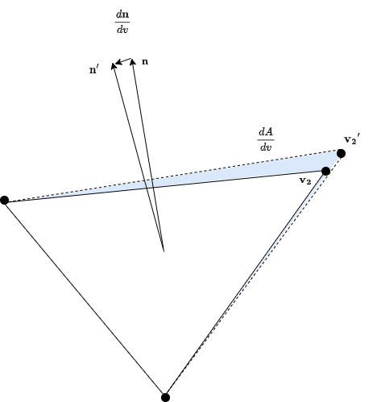
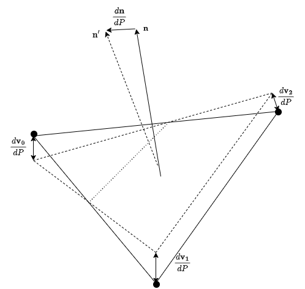

# Sensitivity Definitions

## Cell Definition

```{seealso}
The Cell definition shown below is consistent with the
[Cell](pysagas.geometry.Cell) object.
```


## Vertex Sensitivities




## Parameter Sensitivities




