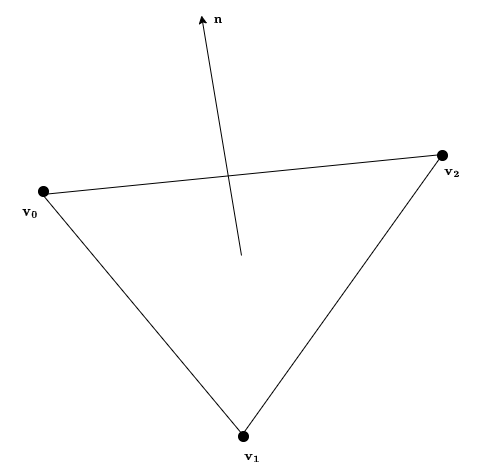
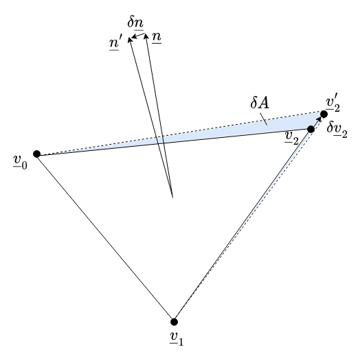

# PySAGAS Definitions

This page defines all symbols, terms and data types used by *PySAGAS*.


(nomenclature)=
## Nomenclature
Some of the nomenclature used by *PySAGAS* is defined in the table below.

| Symbol | Description |
| ------ | ----------- |
| $\mathcal{\underline{v}}$ | Vertex vector |
| $\mathcal{\underline{v}}$ | Normal vector |
| $\underline{\theta}$ | Design parameters vector |
| $A$ | Area |


(cell-definition)=
## Cell Definition

A `Cell` in *PySAGAS* is a triangular element, defined by three 
unique vectors pointing to the cell's vertices, 
$\underline{v}_0, \underline{v}_1$ and $\underline{v}_2$. These vertices
form the corners of the triangular cell, and also form the face 
of the cell. This face has both an area $A$ and a normal vector
$\underline{n}$ associated with it. These properties are defined in
the figure below.

```{seealso}
The Cell definition shown below is consistent with the
{py:class}`.Cell` object.
```




(normal-area-vertex-sens)=
## Cell Normal and Area Sensitivities

<!-- TODO - update this section with links to code methods -->
<!-- should be called Cell normal and area sensitivities -->


Given the definition of a cell above, the sensitivities of the 
cell normal and the cell area to the cell's vertices can be
determined. That is, $\frac{\partial\underline{n}}{\partial\underline{v}}$ and 
$\frac{dA}{\partial\underline{v}}$, respectively. The figure below 
exemplifies how a cell's normal vector and area
changes with variations in one of its vertices, $\underline{v}_2$
to $\underline{v}_2'$.




These sensitivities can be calculated using analytical derivitives. 
<!-- The output of this is a matrix for each sensitivity, of the 
dimensionality shown below. 


 -->

```{seealso}
The calculations of $\frac{\partial\underline{n}}{\partial\underline{v}}$ and 
$\frac{dA}{\partial\underline{v}}$ are implemented in 
{py:meth}`.n_sensitivity` and {py:meth}`.A_sensitivity`,
respectively.
```


(geom-param-sens)=
## Geometric Parameter Sensitivities

Although users of *PySAGAS* are required to provide their own geometric
parameter sensitivities, the figure below may be insightful. To be clear,
a user must provide the sensitivity of each vertex defining a geometry
to the design parameters, that is, $\frac{\partial\underline{v}}{\partial\underline{\theta}}$. The 
diagram in the figure below illustrates a cell's vertices changing as a 
result of a change in a parameter $\theta_1$.


Given $\frac{\partial\underline{v}}{\partial\underline{\theta}}$, the sensitivity of both the cell
normals and cell areas to the deisgn parameters can be calculated using
the chain rule, as per the equations below.

$$
\frac{\partial\underline{n}}{\partial\underline{\theta}} = \frac{\partial\underline{n}}{\partial\underline{v}} \frac{\partial\underline{v}}{\partial\underline{\theta}}
$$


$$
\frac{dA}{\partial\underline{\theta}} = \frac{dA}{\partial\underline{v}} \frac{\partial\underline{v}}{\partial\underline{\theta}}
$$


