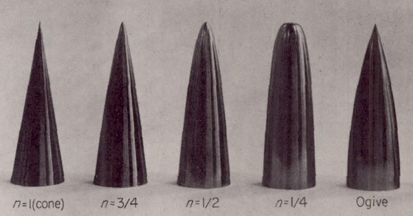
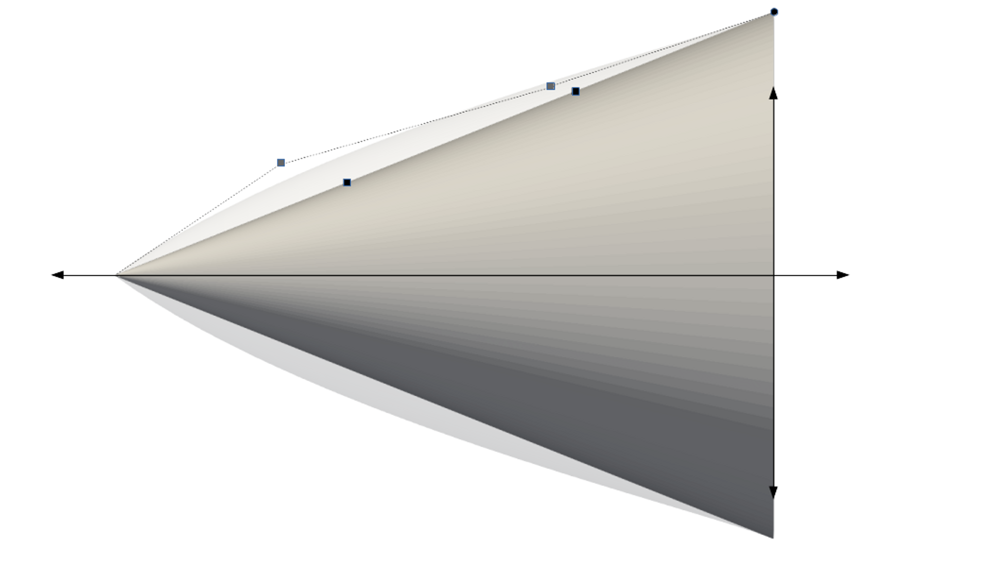
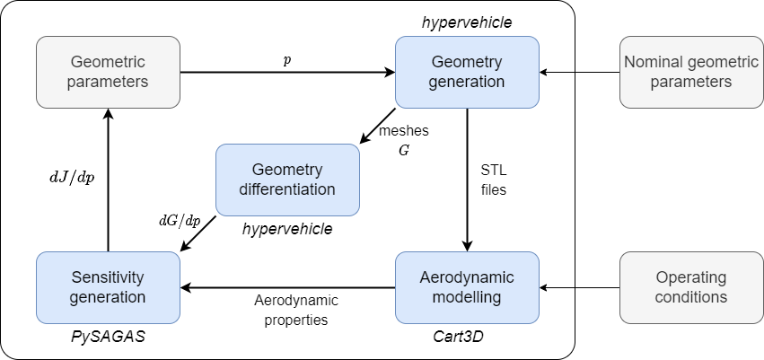
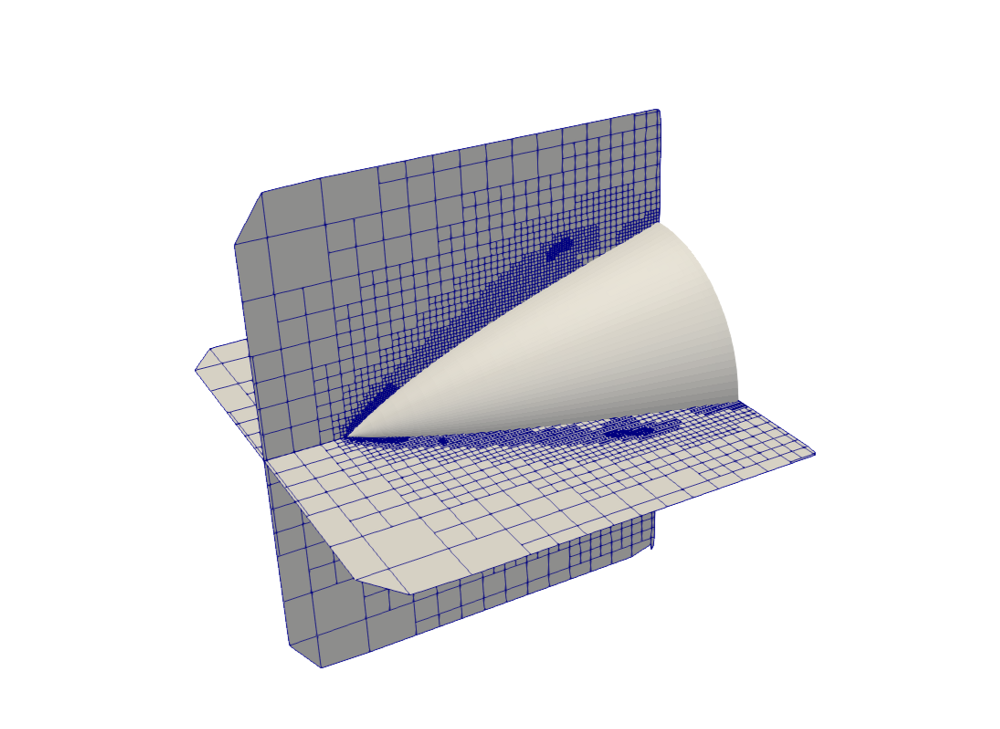
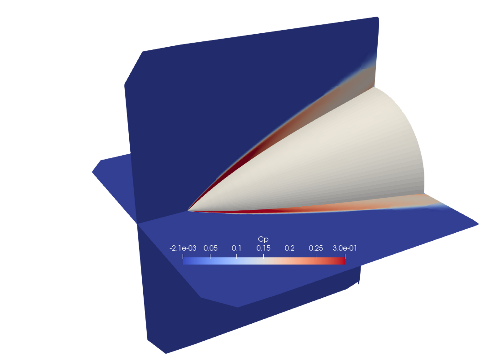
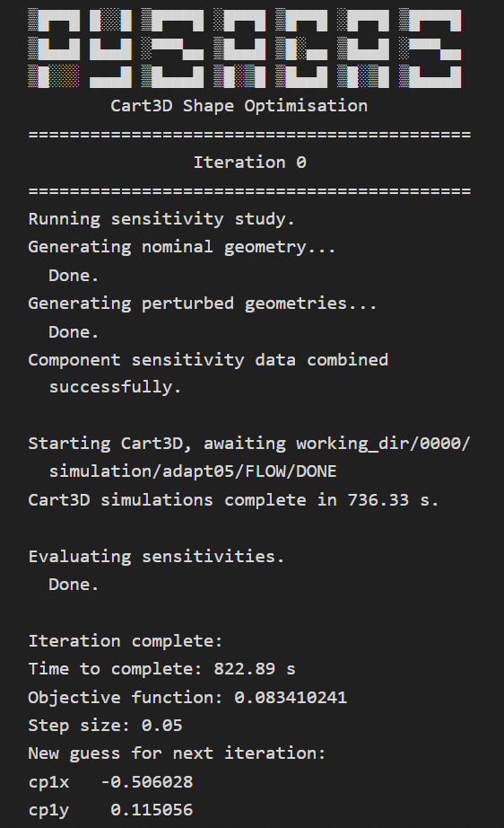
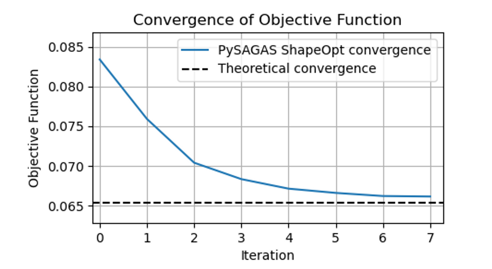
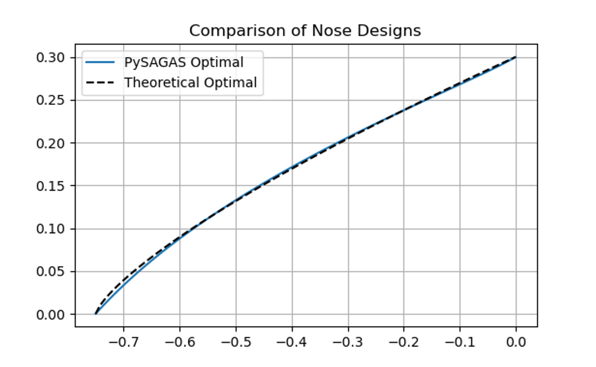

(example-nose-opt)=
# Nose Cone Shape Optimisation
This page illustrates how *pysagas* can be used for design 
optimisation. The example is applied to a nose cone at an
operating point of Mach 6, 0 degrees angle-of-attack. 

(literature-review)=
## Literature Review
A review of literature reveals that the optimal shape 
for an axisymmetric nose at supersonic speeds which minimises
drag for a given length and base diameter is given by the 
exponential function:

(optimal-equation)=
$$
y = R(x/L)^n
$$

The exponent $n$ depends weakly on the Mach number: for Mach 2-4, 
$n$ should be approximately $0.68$; for Mach >4, 
$n \approx 0.69$[^1]. When $n=1$, a sharp cone is produced.

The difference in drag for these exponnents is very slim, so 
previous experimental studies have made approximations with 
$n=0.75$[^2],[^3].

## Geometry Definition

The nose geometry is defined by a Bezier curve with two internal 
control points, as shown in the figure below. These control 
points can move in both the horizontal and vertical direction.
Therefore, there are 4 design parameters in this problem.

## Optimisation Process
The optimisation process follows the schematic in the figure below.
Starting with a nominal set of geometric parameters, 
[*HyperVehicle*](http://github.com/kieran-mackle/HyperVehicle/) is used
to generate STL files. These files are passed into an aerodynamic modelling
package, in order to obtain the nominal flow solution for that geometry.
[*HyperVehicle*](http://github.com/kieran-mackle/HyperVehicle/) is also
used to generate the geometry sensitivities, $dv/dp$, which are used in
conjunction with the flow solution to generate the design parameter 
sensitivities via *pysagas*. Finally, these sensitivities can be 
passed into an optimisation algorithm to update the geometric parameters,
and perform another update iteration. The loop will continue until 
some convergence tolerance is satisfied, at which point the optimal 
geometry will have been reached. This loop has been implemented in 
`pysagas.optimisation.cartd.ShapeOpt`.

In this example, the objective function is the drag coefficient of
the nose cone, neglecting the base drag (as per the 
[prior art](literature-review)).

$$
J = C_D
$$

### Geometry Generation and Differentiation

As mentioned above, the geometry and geometry-parameter 
sensitivities, $dv/dp$, will be generated using the parametric 
geometry generation package, 
[*HyperVehicle*](http://github.com/kieran-mackle/HyperVehicle/).
This package allows a user to parametrically define a vehicle
and output STL files for aerodynamic modelling.

(nose-cart3d-modelling)=
### Aerodynamic Modelling

Given the STL files from the geometry generation module, the geometry
will be simulated in the inviscid CFD solver, 
[*Cart3D*](https://www.nas.nasa.gov/software/cart3d.html). The figure
below shows an example mesh produced by Cart3D.

The corresponding flow solution for this mesh is visualised in the 
figure below.

## Results
With the modules described above in place, the following output will
be displayed when running `ShapeOpt`.

After 7 iterations, the following convergence plot can be created.
Also shown on this plot is the 'theoretical convergence', which 
refers to the drag coefficient of the nose defined by the 
[exponential function](optimal-equation) above, when simulated in the
same manner used in the optimisation.

Finally, the nose geometry produced by *pysagas* can be compared to 
the theoretical optimal nose geometry, defined by the 
[exponential function](optimal-equation) above. This comparison
is shown in the figure below. 

[^1]: [ W. H. Mason and Jaewoo Lee. “Minimum-drag axisymmetric 
bodies in the supersonic/hypersonic flow regimes”. In: Journal of
Spacecraft and 
Rockets 31.3 (1994)](https://arc.aiaa.org/doi/abs/10.2514/3.26453)

[^2]: [Perkins, E.W., Jorgensen, L. H., and Sommer, S. C., 
“Investigation of the Drag of Various Axially Symmetric Nose 
Shapes of Fineness Ratio 3 for Mach Numbers from 1.24 to 7.4,” 
NACA-TR-1386, 
1958.](https://ntrs.nasa.gov/citations/19930091022)

[^3]: [Eggers, A. J. Jr., Resnikoff, M. M., and Dennis, D. H., 
“Bodies of Revolution Having Minimum Drag at High Supersonic 
Airspeeds,” NACA-TR-1306, 1957.](https://ntrs.nasa.gov/citations/19930092299)

