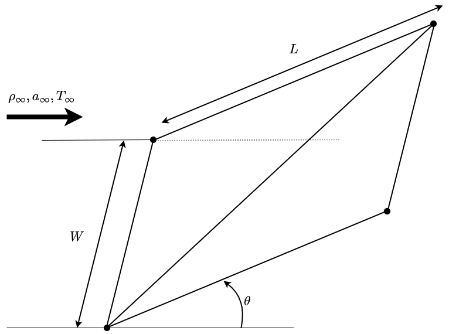

(example-inclined-ramp)=
# Inclined Ramp Example

This page covers a simple test case of an inclined ramp.

## Problem Definition

The parameters of this problem are 
$\underline{\theta} = [\theta, \, L, \, W]$, shown
diagramatically in the figure below. The geometry is
built from two [cells](cell-definition), sharing a common edge.

### Free Stream Conditions
The freestream conditions are defined below.

$$\gamma = 1.4$$

$$ Mach_{freestream} = 6$$

$$ P_{freestream} = 700 Pa$$

$$ T_{freestream} = 70 K$$

## Analytical Solution
This problem can be solved analytically using simple
isentropic flow relations and shock expansion theory. 
This solution will later serve as validation for the 
results obtained using *PySAGAS*.

(oblique-shock-relations)=
### Oblique Shock Relations
The nominal ramp conditions are solved using 
[oblique shock wave theory](http://brennen.caltech.edu/fluidbook/basicfluiddynamics/compressibleflow/obliqueshock.pdf).

$$
\frac{p_2}{p_1} = 1 + \frac{2\gamma}{\gamma+1} (M_1^2 \sin^2\beta - 1)
$$

$$
\frac{\rho_2}{\rho_1} = \frac{(\gamma + 1)M_1^2 \sin^2 \beta}
{(\gamma - 1)M_1^2 \sin^2 \beta + 2}
$$

$$
\frac{T_2}{T_1} = \frac{p_2}{p_1} \frac{\rho_1}{\rho_2}
$$

$$
M_2 = \frac{1}{\sin(\beta - \theta)} \sqrt{
    \frac{1 + \frac{\gamma-1}{2}M_1^2 \sin^2\beta}
    {\gamma M_1^2\sin^2\beta - \frac{\gamma-1}{2}}
}
$$

The oblique shock angle is found by solving the $\theta-\beta-M$ 
equation, shown below for reference.

$$
\tan \theta = 2 \cot \beta \frac{M_1^2\sin^2\beta - 1}
{M_1^2 (\gamma + \cos2\beta) + 2}
$$

### Calculating Ramp Conditions
Using the oblique shock relations presented above, the following 
conditions on the ramp surface can be calculated.

|  Property       | Ramp Value | 
|-----------------|-----------|
|  $M_{ramp}$     |  4.65      |
|  $P_{ramp}$     |  2567.41 Pa |
|  $T_{ramp}$     |  107.89 K   |
|  $\rho_{ramp}$  |  0.0829 kg/m^3 |

### Sensitivity Results
The force sensitivities for each ramp design parameter can
be calculated using the method of finite differencing. Performing
such a study produces the results shown in the table below.

$$
F = P \times A \times \underline{n}_{ramp} \cdot \underline{u}
$$

|  Parameter      | $dF_x/dp$ | $dF_y/dp$ | $dF_z/dp$ |
|-----------------|-----------|-----------|-----------|
|  $\theta$       |  1.07  |  -3.11   |  0  |
|  $L$            |  8.92  |  -50.57  |  0  |
|  $W$            |  4.46  |  -25.28  |  0  |

## PySAGAS Solution
Given the surface properties on the ramp calculated using
the analytical solution, the parameter sensitivities can
be approximated using *PySAGAS*. Note, the error of each 
sensitivitiy, as calculated using the analytical solution
for reference, is shown in brackets.

|  Parameter      | $dF_x/dp$ | $dF_y/dp$ | $dF_z/dp$ |
|-----------------|-----------|-----------|-----------|
|  $\theta$       |  1.09 (-1.6%) | -3.20 (-3.1%)  |  0 (0%) |
|  $L$            |  8.92 (0%) | -50.57 (0%)  |  0 (0%) |
|  $W$            |  4.46 (0%) | -25.28 (0%)  |  0 (0%) |

