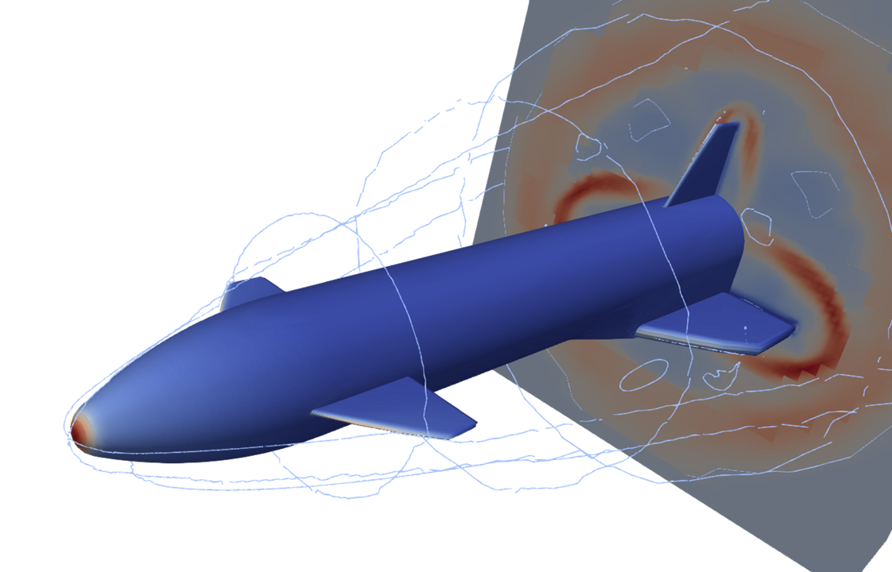

# **PySAGAS** Documentation


```{include} ../../README.md
:start-after: <!-- start intro -->
:end-before: <!-- end intro -->
```

To learn more about the theory behind *PySAGAS*, see the 
[theory documentation](theory-docs). Otherwise, see the 
[Getting Started](documentation/getting-started) guide, 
or have a look at the [examples](examples/ramp_3d.md).




```{toctree}
:maxdepth: 2
:hidden:
:caption: DOCUMENTATION

Getting Started <documentation/getting-started>
Usage <documentation/usage>
Theory <documentation/theory>
Definitions <documentation/definitions>
```


```{toctree}
:maxdepth: 2
:hidden:
:caption: Case Studies

Inclined Ramp <examples/ramp_3d>
Sharp Wedge <examples/sharp_wedge>
Shape Optimisation <examples/nose_cone>
```


```{toctree}
:maxdepth: 2
:hidden:
:caption: API REFERENCE

Geometry Module <api_ref/geometry/index>
Flow Module <api_ref/flow>
Utilities <api_ref/utilities>
Wrappers <api_ref/wrappers/index>
Optimisation <api_ref/optimisation/index>
```


```{toctree}
:maxdepth: 3
:hidden:
:caption: Source Code

Contributing <documentation/contributing_docs/index>
Changelog <documentation/changelog>
```
