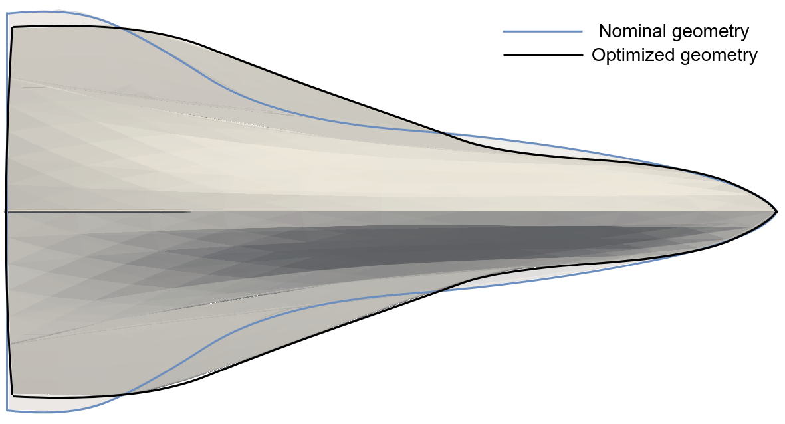

# Summary

**PySAGAS** is a **Py**thon package for **S**ensitivity **A**pproximations of **G**eometric and **A**erodynamic **Surface** properties. 
It provides a computationally-efficient method for approximating the sensitivities of aerodynamic forces and moments with respect to design parameters, from nominal surface properties provided by a single CFD flow solution.
The sensitivities outputted by **PySAGAS** can be used for sensitivity studies, or for aerodynamic shape optimisation.
**PySAGAS** also provides a conventient API to multiple senstivity model implementations, as well as optimisation wrappers and geometry utilities.

The Pyhon package has been developed according to best practices, and extensive documentation is provided.

# Statement of need

{ width=70% }

+-------------------+-------------------------------+
| Sensitivity model | Time to converge [hh:mm:ss]   |
|                   |                               |
+:=================:+:=============================:+
| Van Dyke's theory |           4:02:55             |
+-------------------+-------------------------------+
| Piston theory     |           6:15:18             |
+-------------------+-------------------------------+
| Adjoint CFD       |           6:40:00             |
+-------------------+-------------------------------+
| Finite difference |       2 days, 8:40:00         |
+===================+===============================+

Getting errors in the build (locally) whenever citations are included. Need to try with GitHub actions to see if the errors persist.

<!-- PySAGAS paper [@MackleShapeOpt] -->

# Acknowledgements

# References
