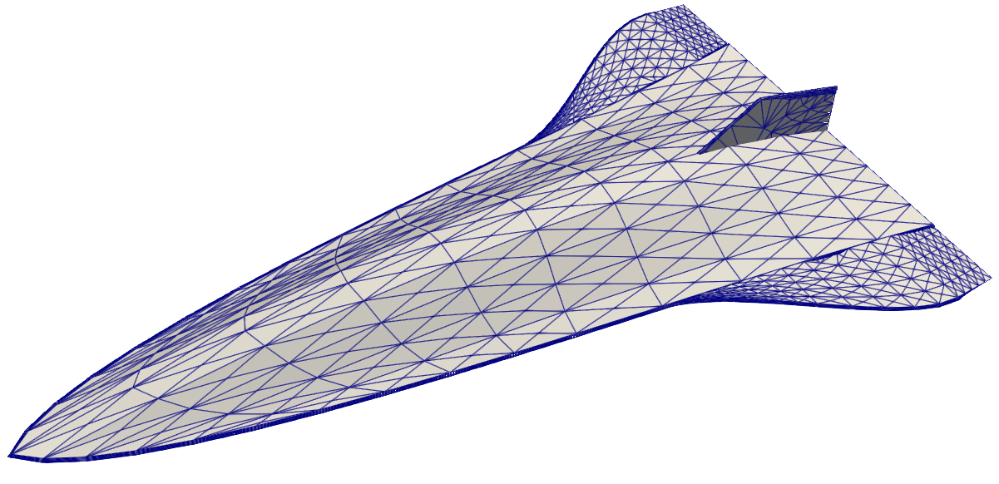
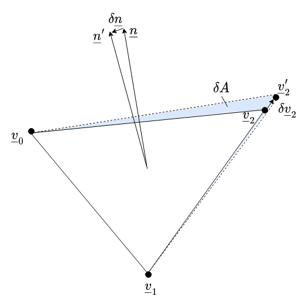

# Summary

PySAGAS is a **Py**thon package for **S**ensitivity **A**pproximations of **G**eometric and **A**erodynamic **S**urface properties. 
It provides a computationally-efficient method for approximating the sensitivities of aerodynamic forces and moments with respect to design parameters, from nominal surface properties provided by a single CFD flow solution.
The sensitivities outputted by PySAGAS can be used for sensitivity studies, or for aerodynamic shape optimisation.
PySAGAS also provides a conventient API to multiple senstivity model implementations, as well as optimisation wrappers and geometry utilities.

The Pyhon package has been developed according to best practices, and extensive documentation is provided online.

# Statement of need

Gradient-based optimization techniques possess many desireable characteristics for the application of aerodynamic shape optimisation.
Specifically, these techniques are known for being efficient and scalable with the number of design parameters.
As the name implies, they require information about the gradient of the objective function with respect to the design parameters.
For analytical or computationally-inexpensive problems, this is a relatively straightforward hurdle to overcome.
Analytical expressions can easily be differentiated, and gradient information can be extracted from inexpensive problems by use of numerical techniques, such as finite-differencing.
However, as the system being optimised becomes more computationally demanding, either by virtue of complexity or dimensionality, these approaches of calculating gradient information are either impossible or intractable.

PySAGAS implements a novel solution to this problem in the context of hypersonic vehicle design.
A detailed description of the methodology employed can be found in [@MackleShapeOpt].
This package has played a key role in research conducted for the efficient optimisation of hypersonic vehicle configurations [@MackleCoDesign].

# Theory

The core idea underpinning PySAGAS is to use low-order, differentiable fluid models to evaluate the sensitivities of surface pressures to geometric design parameters.
This is performed on a surface-local basis.
To explain this, consider the surface mesh shown in the image below, which discretizes the continuous surface into triangular elements.
Each of these triangular elements is defined by three vertices, and has an associated area and normal vector.

{ width=40% }
{ width=40% }

The force acting on one of these elements is given by multiplying the pressure acting on the element by the area of the element.
By also multipling by the normal vector of the cell, a force vector is obtained.
This can be performed for every cell defining the surface of the geometry, yielding the net aerodynamic force vector.

$$
\underline{F} =  P(\underline{\theta}) \, A(\underline{\theta}) \, \underline{n}(\underline{\theta})
$$

$$
\underline{F}_{\text{ net}} = \sum_{i=0}^{N}  \underline{F}_{\text{ i}}
$$

This expression can be differentiated with respect to the set of design parameters, $\underline{\theta}$.
Doing so reveals a dependency on three sensitivity terms: a pressure sensitivity, a cell area sensitivity, and a cell normal vector sensitivity.

$$
\frac{\partial\underline{F}_{\text{net}}}{\partial\underline{\theta}} = \sum_{i=0}^N 
\biggl[ 
    \underbrace{
        \frac{\partial P_i}{\partial\underline{\theta}} A_i(\underline{\theta})\underline{n}_i(\underline{\theta})
    }_\text{pressure sensitivity}
    \: + \:
    \underbrace{
        P_i(\underline{\theta}) \frac{\partial A_i}{\partial\underline{\theta}} \underline{n}_i(\underline{\theta})
    }_\text{area sensitivity}
    \: + \:
    \underbrace{
        P_i(\underline{\theta}) A_i(\underline{\theta})\frac{\partial\underline{n}_i}{\partial\underline{\theta}}
    }_\text{normal sensitivity}
\biggr]
$$

The pressure sensitivity term requires special attention to compute $\frac{\partial P}{\partial\underline{\theta}}$, the variation of the local pressure due to a change in design parameter.
This is where the low-order, differentiable fluid models come in handy.
One possibility is to use local Piston theory, as presented in [@Zhang2009].

$$
P = P_l + \rho_l \, a_l \, v_n
$$

This expression relates the pressure $P$ due to a piston-like perturbation $v_n$, relative to the local flow conditions (denoted by the subscript $l$).
In this context, the piston-like perturbation is caused by changes in design parameters $\underline{\theta}$.
We can therefore obtain the required pressure sensitivity $\frac{\partial P}{\partial \underline{\theta}}$ by differentiating the expression above:

$$
\frac{\partial P}{\partial\underline{\theta}} = \rho_l a_l v_l \left( -\frac{\partial\underline{n}}{\partial\underline{\theta}} \right)
$$

The sensitivity $\frac{\partial\underline{n}}{\partial\theta}$ can be obtained through geometry differentiation.

The area and normal sensitivity terms require information about how the surface mesh varies with the design parameters.
Specifically, how the vertices of each cell depend on $\underline{\theta}$, that is $\frac{\partial \underline{v}}{\partial \underline{\theta}}$.
This should be available from the geometry generation software being used.
Given this, the differential terms can be computed using geometry and the expressions below.

<!-- { width=50% } -->

$$
\frac{\partial A_i}{\partial \underline{\theta}} = \frac{\partial A_i}{\partial \underline{v}_i} \frac{\partial \underline{v}_i}{\partial \underline{\theta}}
$$
$$
\frac{\partial \underline{n}_i}{\partial\underline{\theta}} = \frac{\partial \underline{n}_i}{\partial \underline{v}_i} \frac{\partial \underline{v}_i}{\partial \underline{\theta}}
$$

<!-- How accurate is it? -->

# References
